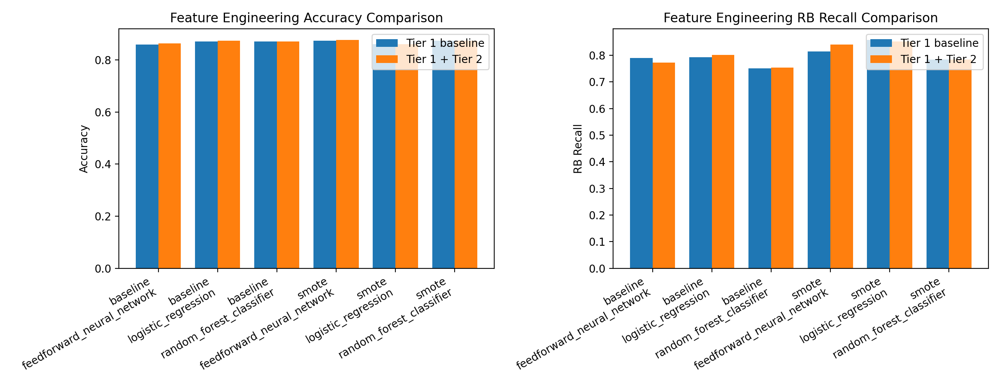
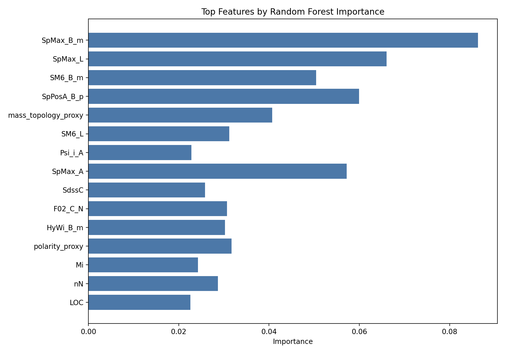
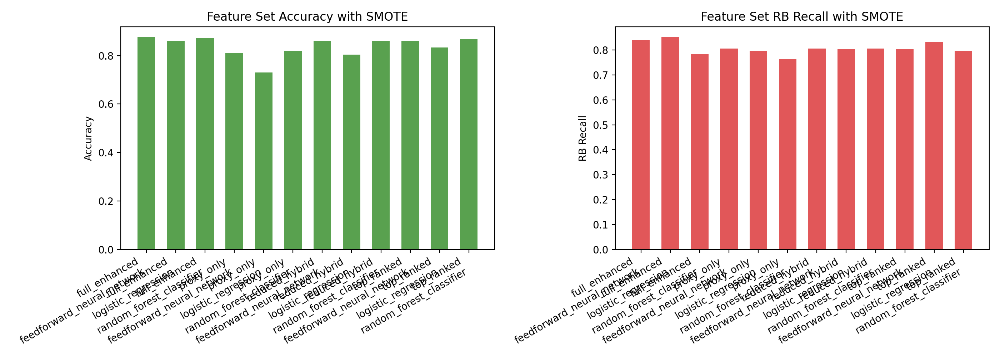
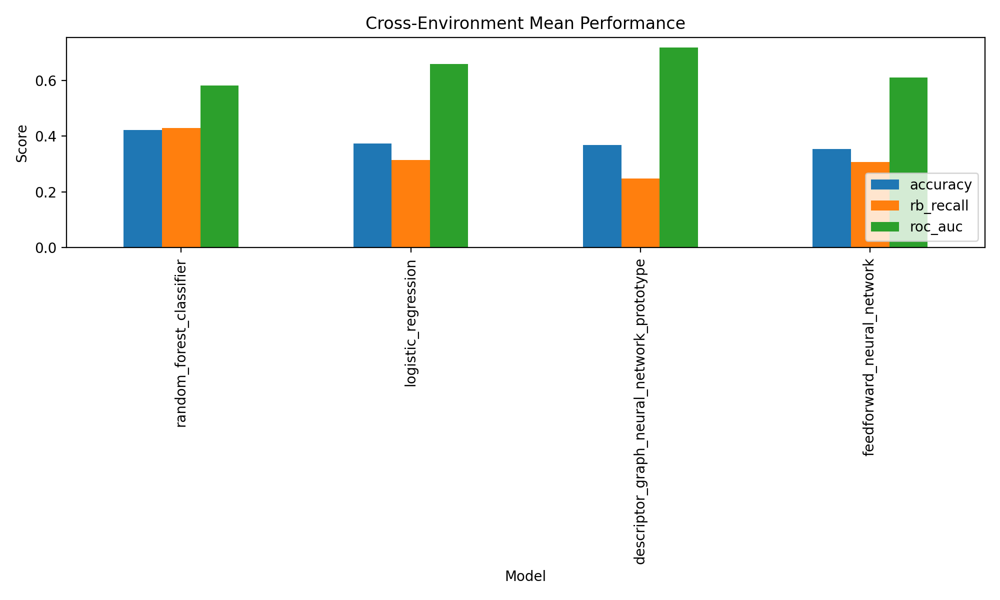
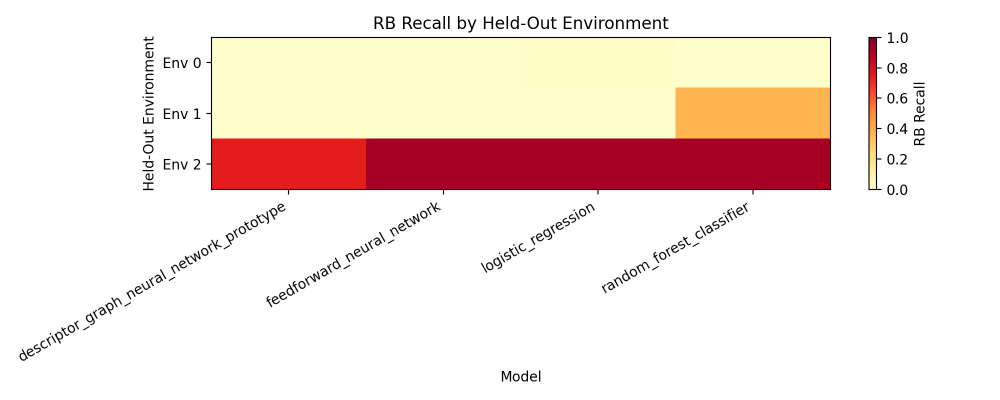
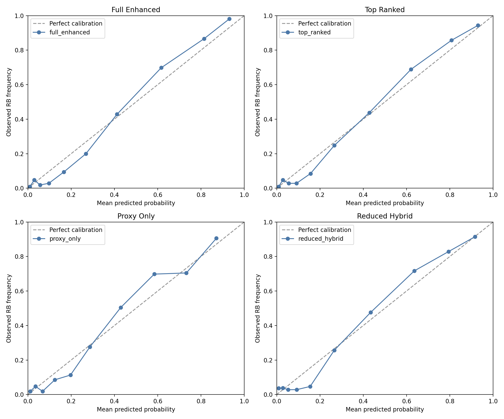
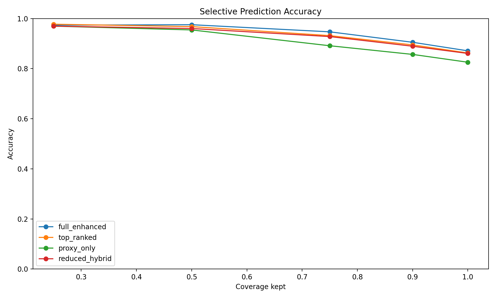
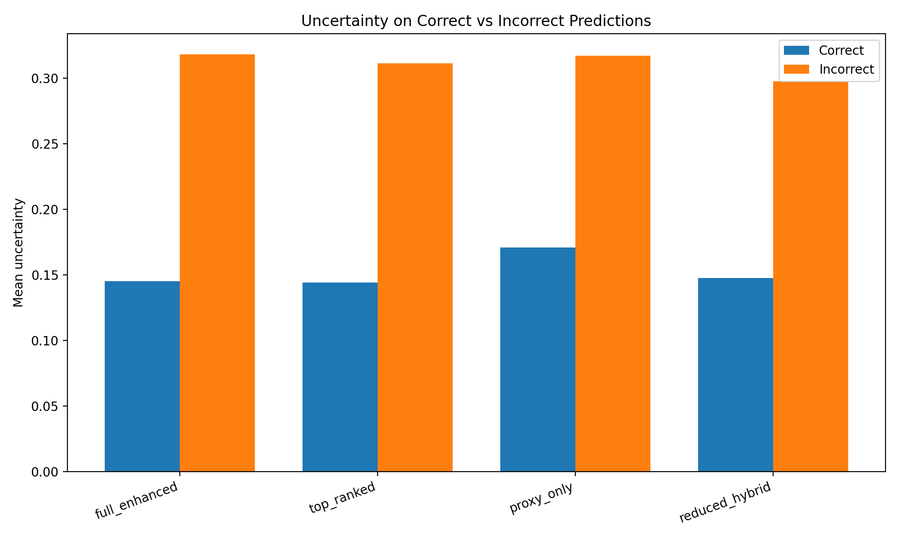

# Main Findings

This report is the fastest visual entry point into the project's scientific results. It summarizes the central conclusions and links each claim to generated figures and result tables.

## Central Finding

High predictive accuracy alone was not enough to identify the most trustworthy biodegradation model. Reliability metrics, calibration, uncertainty behavior, selective prediction, and cross-environment testing revealed meaningful differences between models and feature sets.

The final recommended model is:

```text
top_ranked | random_forest_classifier
```

Supporting table:

```text
results/tables/model_reliability_scoreboard.csv
```


## Accuracy Versus Reliability

The strongest standard accuracy model was not automatically the strongest overall reliability candidate. The reliability-centered scoreboard balances in-distribution accuracy, calibration, selective prediction, and cross-environment behavior.


## Feature Engineering Finding

Chemistry-informed proxy features helped test whether descriptor engineering could improve biodegradation prediction. The comparison showed that engineered descriptors can improve some metrics, but the broader reliability story depends on how those features interact with model class, calibration, and distribution shift.

Supporting table:

```text
results/tables/feature_engineering_model_results.csv
```



## Feature Selection Finding

Feature selection was important because smaller or ranked feature sets could remain competitive while supporting stronger reliability behavior. The final recommendation uses the `top_ranked` feature set rather than the full enhanced feature set.

Supporting tables:

```text
results/tables/feature_importance_rankings.csv
results/tables/feature_selection_model_results.csv
```





## Cross-Environment Generalization Finding

Proxy cross-environment validation exposed distribution-shift behavior that ordinary cross-validation could hide. This is one of the most important reliability checks because a biodegradation model should be useful beyond the descriptor region it was trained on.

Supporting table:

```text
results/tables/cross_environment_validation_summary.csv
```





## Uncertainty And Calibration Finding

Uncertainty was useful when incorrect predictions had lower confidence than correct predictions. However, under cross-environment shift, some candidates became overconfident while wrong, which is a key reliability risk.

Supporting tables:

```text
results/tables/uncertainty_reliability_metrics.csv
results/tables/cross_environment_uncertainty_metrics.csv
```







## Feedforward Neural Network Finding

The feedforward neural network was tested as a nonlinear dense baseline for tabular QSAR descriptors. It was scientifically useful as a complexity check, but it did not automatically outperform the strongest classical models. This supports the broader conclusion that model complexity alone is not sufficient for trustworthy biodegradation prediction.

Supporting report:

```text
reports/neural_network_baseline_summary.txt
```

## Recommended Reading Order

1. `README.md`
2. `reports/main_findings.md`
3. `reports/model_reliability_report.md`
4. `reports/uncertainty_reliability_summary.txt`
5. `results/tables/model_reliability_scoreboard.csv`
