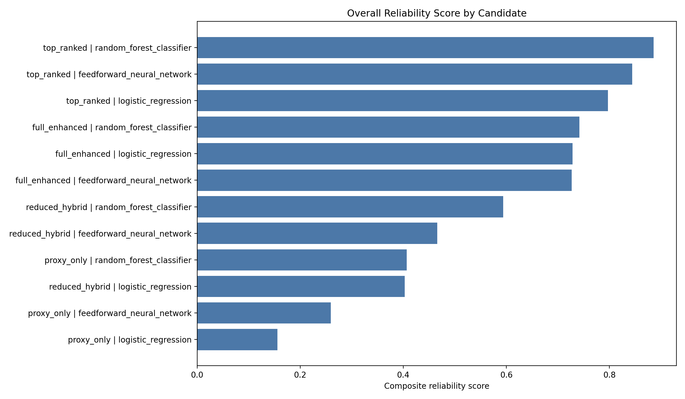
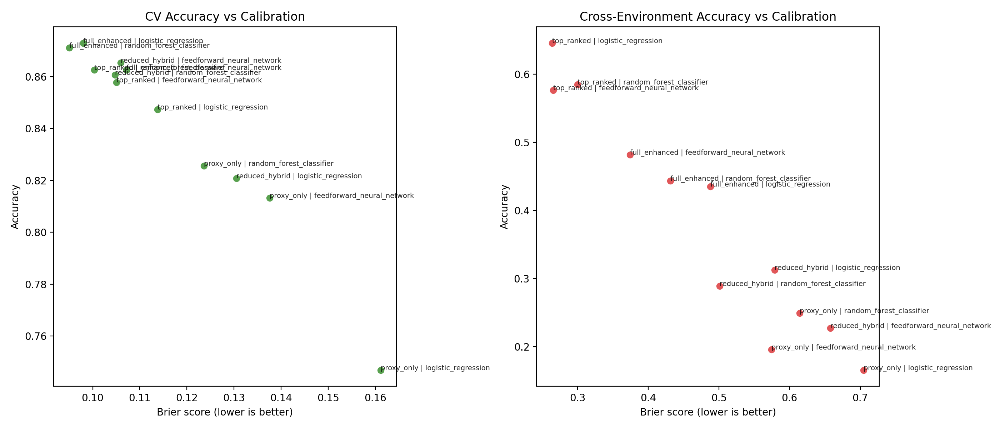
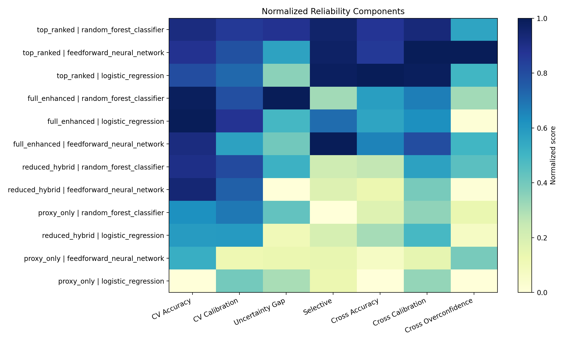
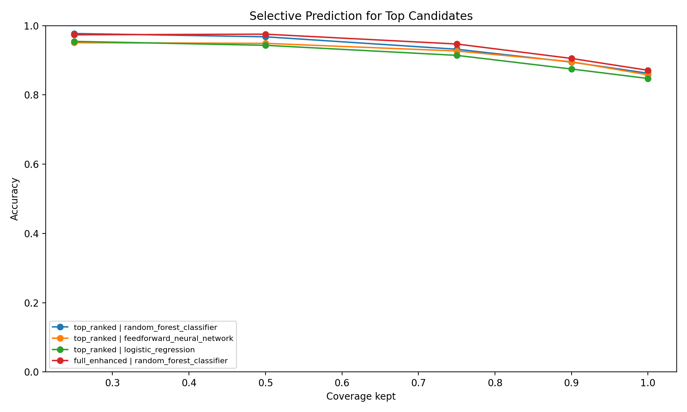

# Model Reliability Scoreboard Report

## Objective

The final model selection step focuses on reliability-centered model selection through reliability analysis rather than raw performance alone. The goal is to compare model and feature-set combinations on accuracy, calibration, uncertainty behavior, selective prediction, and cross-environment robustness in order to recommend a final model that is not only accurate, but also trustworthy.

## Approach

The reliability pipeline reuses the selected feature sets and uncertainty analysis outputs. Each candidate combines one model and one feature set. Candidates are evaluated under both stratified cross-validation and cross-environment validation. The comparison includes accuracy, ROC-AUC, Brier score, log loss, expected calibration error, uncertainty separation between correct and incorrect predictions, selective prediction performance at reduced coverage, and cross-environment failure behavior.

## Headline Findings

- Best overall candidate: `top_ranked | random_forest_classifier` with reliability score `0.8860`.
- Strongest standard accuracy: `full_enhanced | logistic_regression` at `0.8730`.
- Best calibration in-distribution: `full_enhanced | logistic_regression` with Brier `0.0980` and ECE `0.0280`.
- Best cross-environment accuracy: `top_ranked | logistic_regression` at `0.6455`.
- Strongest uncertainty separation: `full_enhanced | random_forest_classifier` with uncertainty gap `0.1727`.
- Best selective prediction at 25% coverage: `full_enhanced | feedforward_neural_network` at `0.8163`.
- Most overconfident under cross-environment shift: `proxy_only | logistic_regression` with incorrect confidence `0.9044`.
- Feedforward neural network finding: the dense neural baseline did not dominate the classical models by raw accuracy, but it remained informative as a nonlinear comparison point. In the reliability scoreboard, its strongest cases appear under selected feature sets, showing that model complexity only helps when paired with a suitable representation and reliability checks.

## Final Recommendation

The recommended final model is `top_ranked | random_forest_classifier`. It provides the best overall balance between prediction quality and trustworthiness when the evaluation includes both in-distribution and cross-environment behavior. This recommendation is based on a composite reliability score rather than accuracy alone, which better reflects the project goal of selecting a model that is dependable as well as predictive.

## Interpretation

This analysis confirms that the strongest final model is not necessarily the one with the single highest accuracy on a standard split. A stronger final choice is the candidate that stays competitive on accuracy while also showing better calibration, better uncertainty behavior on wrong predictions, and less severe collapse under distribution shift. This allows the project to move from simple model comparison toward a more defensible final-model justification.

The feedforward neural network was included to test whether dense nonlinear modeling could extract additional signal from tabular descriptor features. Its mixed performance is an important negative result: neural-network complexity alone did not solve the biodegradation prediction problem. The result supports a more careful interpretation that representation quality, feature selection, calibration, and distribution-shift behavior matter as much as model class.

## Key Figures

## Candidate Table

| Rank | Candidate | Reliability Score | CV Accuracy | CV Brier | CV ECE | Selective Acc. 25% | Cross Acc. | Cross Brier | Incorrect Cross Confidence |
| --- | --- | --- | --- | --- | --- | --- | --- | --- | --- |
| 1 | `top_ranked | random_forest_classifier` | 0.8860 | 0.8626 | 0.1003 | 0.0297 | 0.8030 | 0.5848 | 0.2998 | 0.7748 |
| 2 | `top_ranked | feedforward_neural_network` | 0.8447 | 0.8578 | 0.1050 | 0.0247 | 0.8068 | 0.5763 | 0.2656 | 0.6731 |
| 3 | `top_ranked | logistic_regression` | 0.7971 | 0.8474 | 0.1138 | 0.0268 | 0.8106 | 0.6455 | 0.2641 | 0.7889 |
| 4 | `full_enhanced | random_forest_classifier` | 0.7421 | 0.8711 | 0.0950 | 0.0387 | 0.5909 | 0.4436 | 0.4313 | 0.8316 |
| 5 | `full_enhanced | logistic_regression` | 0.7288 | 0.8730 | 0.0980 | 0.0280 | 0.7216 | 0.4351 | 0.4877 | 0.9020 |
| 6 | `full_enhanced | feedforward_neural_network` | 0.7269 | 0.8626 | 0.1071 | 0.0408 | 0.8163 | 0.4815 | 0.3740 | 0.7896 |
| 7 | `reduced_hybrid | random_forest_classifier` | 0.5943 | 0.8607 | 0.1048 | 0.0291 | 0.5606 | 0.2891 | 0.5012 | 0.8009 |
| 8 | `reduced_hybrid | feedforward_neural_network` | 0.4660 | 0.8654 | 0.1059 | 0.0313 | 0.5455 | 0.2275 | 0.6577 | 0.9017 |
| 9 | `proxy_only | random_forest_classifier` | 0.4066 | 0.8256 | 0.1236 | 0.0219 | 0.4867 | 0.2493 | 0.6144 | 0.8732 |
| 10 | `reduced_hybrid | logistic_regression` | 0.4029 | 0.8209 | 0.1305 | 0.0240 | 0.5530 | 0.3128 | 0.5788 | 0.8891 |
| 11 | `proxy_only | feedforward_neural_network` | 0.2594 | 0.8133 | 0.1375 | 0.0595 | 0.5341 | 0.1962 | 0.5742 | 0.8147 |
| 12 | `proxy_only | logistic_regression` | 0.1560 | 0.7469 | 0.1612 | 0.0136 | 0.5284 | 0.1659 | 0.7050 | 0.9044 |
